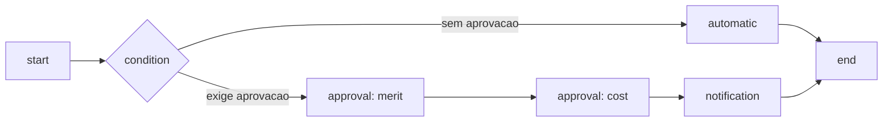

# Workflow de aprovacao

## Objetivo

O dominio de aprovacao resolve grafos versionados, candidatos, alcadas,
delegacoes, segregacao de funcoes, SLA e decisoes auditaveis. Ele nao confia no
aprovador enviado pelo navegador.

Componentes principais:

- `lib/approvals/graph.ts`: validacao do grafo e ordem topologica;
- `lib/approvals/resolver.ts`: resolucao de candidatos;
- `lib/approvals/decision.ts`: conclusao `any`, `all`, `quorum` e `first`;
- `lib/approvals/delegation.ts`: delegacao limitada por escopo e vigencia;
- `lib/approvals/sla.ts`: calendario, vencimento e lembretes;
- `lib/server/approval-service.ts`: persistencia, guards, transacoes e auditoria;
- migrations `0009`, `0010`, `0011` e `0012`;
- APIs em `app/api/approvals/**`.

## Modelo

Tipos de no:

- `start`;
- `approval`;
- `automatic`;
- `condition`;
- `notification`;
- `end`.

Um workflow publicado e imutavel. Instancias guardam o snapshot/versionamento
utilizado, de modo que editar o fluxo futuro nao reescreve uma aprovacao ativa.

## Tipos de aprovacao

O modelo aceita merito, custo, orcamento, operacional, seguranca, internacional,
financeiro, executivo, centro de custo, projeto, empresa, grupo, viajante,
debito, nacional, segundo nivel, lista e linha de rateio.

## Resolucao de aprovadores

Seletores suportados incluem:

- pessoa, papel, cargo e nivel;
- grupo, empresa e filial;
- centro de custo, projeto, conta e orcamento;
- solicitante, viajante e gestor;
- alcada, valor e moeda;
- produto, destino, violacao de politica e risco.

Combinacoes:

- `all`: todos os seletores devem contribuir;
- `union`: uniao dos candidatos;
- `first_non_empty`: primeiro seletor com resultado.

O fluxo tambem define fallback, minimo/maximo de aprovadores, autoaprovacao e
segregacao contra solicitante, viajante, ultimo editor ou executor financeiro.

Se a resolucao nao atingir o minimo, a aprovacao nao e inventada nem
autoaprovada; a instancia permanece bloqueada para intervencao.

## Conclusao do passo

| Modo | Regra |
| --- | --- |
| `any` | Uma aprovacao valida conclui |
| `all` | Todos os assignments ativos precisam aprovar |
| `quorum` | O numero configurado precisa aprovar |
| `first` | A primeira decisao valida encerra o passo |

Rejeicao, cancelamento, expiracao e reatribuicao permanecem no historico. Os
assignments nao utilizados sao cancelados conforme a regra de conclusao.

## Delegacao

Uma delegacao possui:

- delegante e delegado no mesmo tenant;
- inicio e fim;
- empresas, grupos e modulos permitidos;
- justificativa;
- estado agendado, ativo, revogado ou expirado.

O delegado precisa estar ativo e habilitado para receber delegacao. A delegacao
nao amplia o escopo original nem concede administracao de plataforma. Revogacao
nao apaga decisoes ja tomadas.

## Alcadas

`approval_authorities` limita autoridade por tipo de aprovacao, escopo, valor,
valor acumulado, percentual sobre menor/media tarifa, orcamento, urgencia,
moedas, produtos, destinos, violacoes e risco.

O servidor recalcula candidatos e alcadas. IDs enviados pelo frontend nao
substituem a resolucao.

## SLA

O SLA usa timezone, calendario semanal e feriados. O resultado informa:

- prazo final;
- lembretes;
- `on_time`, `due_soon` ou `overdue`;
- minutos restantes.

O processador de SLA registra notificacao/escalacao de forma idempotente. O job
precisa ser agendado no ambiente de producao; apenas existir uma rota nao cria o
agendamento externo.

## Seguranca das decisoes

- sessao e tenant sao obrigatorios;
- o assignment precisa pertencer ao usuario ou a um contexto administravel;
- decisao repetida usa idempotencia;
- token de acao e hash, expiravel e de uso unico;
- transacoes usam locks para evitar duas conclusoes concorrentes;
- mudanca de versao/estado gera conflito, nao sobrescrita;
- auditoria guarda ator, evento e contexto;
- RLS e FKs compostas isolam tenants.

## APIs principais

- workflows: listar, criar, detalhar, versionar e transicionar;
- instancias: criar e consultar;
- assignments: decidir;
- delegacoes e alcadas: criar/revogar;
- notificacoes: listar/marcar como lida;
- SLA: processar;
- tokens de acao: emitir conforme permissao.

Todas ficam em `app/api/approvals/**`; o inventario completo e gerado em
`docs/FEATURE-INVENTORY.generated.md`.

## Evidencias

- `tests/unit/approval-engine.test.ts`
- `tests/unit/approval-admin-schema.test.ts`

Testes de concorrencia e RLS em PostgreSQL usam `TEST_DATABASE_URL` e foram
executados em 24/07/2026 contra banco descartavel com papel web sem bypass.
O mesmo gate continua obrigatorio no CI e em staging.
