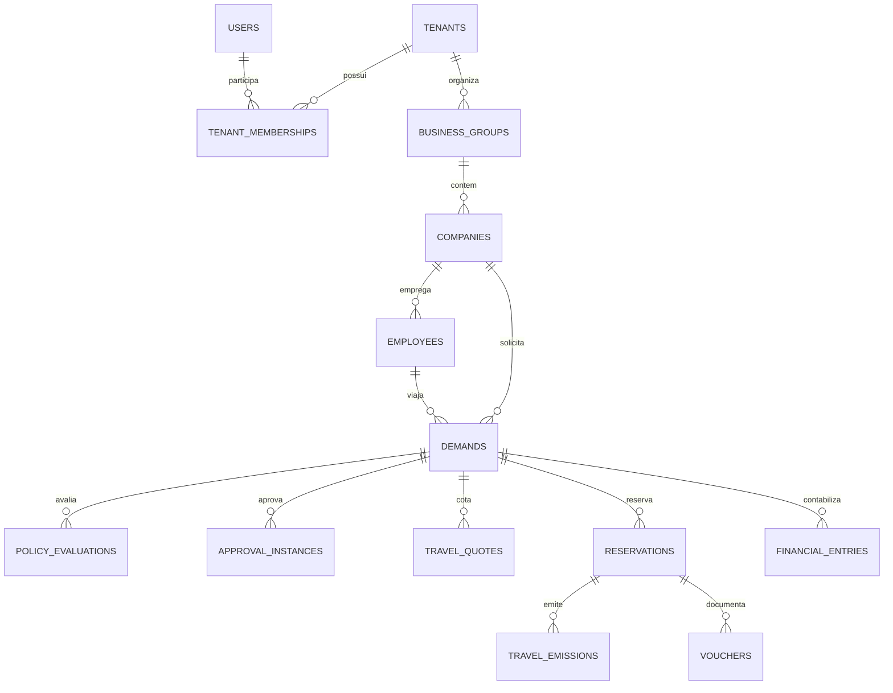

# Modelo de dados

## Principios

- PostgreSQL 16 e a fonte oficial.
- Toda tabela de negocio possui `tenant_id` e RLS quando aplicavel.
- Chaves compostas evitam associacoes entre tenants.
- Operacoes criticas usam transacao, idempotencia e optimistic locking.
- Valores monetarios persistentes usam `numeric`, nunca `real` ou `double precision`.
- Eventos usam `timestamptz`; conceitos de calendario usam `date`.

## Visao relacional

## Grupos de tabelas

- Controle SaaS: tenants, plans, subscriptions, usage.
- Identidade: users, credentials, sessions, memberships, invites e reset tokens.
- Autorizacao: roles, permissions, grants de grupo/empresa e preferencias.
- Diretorio: groups, companies, units, cost centers, projects, employees e aliases.
- Politicas: definitions, versions, scopes, rule sets, conditions, actions, conflicts,
  publications, evaluations, decisions, violations e simulations.
- Aprovacoes: workflow definitions/versions, nodes, edges, instances, steps,
  assignments, decisions, delegations, authorities, SLAs e notifications.
- Viagem: demands, events, quotes, reservations, segments, emissions, vouchers,
  cancellations, refunds e provider operations.
- Financeiro: budgets, commitments, entries, wallets, cards, movements e invoices.
- Integracoes: providers, mappings, logs, webhook events e outbox.
- Assistente: conversations, messages, settings, tools, events e agent operations.
- Governanca: audit logs, idempotency, migration runs, discrepancies e rollouts.

## RLS

`withTenantTransaction` define `app.tenant_id` somente dentro da transacao. As policies
comparam esse valor ao `tenant_id` da linha. As migrations ativam e forcam RLS. A aplicacao
deve usar um papel sem `BYPASSRLS`; `/api/ready` recusa configuracao insegura.

A migration `0049_identity_plane_rls.sql` tambem protege a camada de identidade.
Consultas de login, sessao, convite, reset e administracao da plataforma usam contextos
restritos e transacionais:

- `app.identity_user_id`: somente a identidade individual em autenticacao/reset;
- `app.session_token_hash`: somente a sessao identificada pelo token opaco;
- `app.invite_token_hash`: somente o convite identificado pelo token opaco;
- `app.platform_admin_user_id`: somente administrador ativo verificado no banco.

Sem um desses contextos ou `app.tenant_id`, a politica nega o acesso.

A migration `0050_password_reset_tenant_binding.sql` vincula cada novo token de
recuperacao ao tenant escolhido na solicitacao. Isso evita que uma identidade
multi-tenant gere auditoria de confirmacao em outro tenant.

## Integridade e concorrencia

- unicidade parcial evita grants ativos duplicados;
- triggers validam empresa selecionada dentro do grupo;
- constraints protegem estados, periodos e JSON;
- `version` protege alteracoes concorrentes;
- idempotency keys protegem demanda, reserva, emissao, voucher e operacoes externas;
- sequencias de voucher ficam em `tenant_number_sequences`;
- reset calcula ordem pelas FKs e falha se surgir tabela nao classificada.

## Migrations

As migrations ficam em `deploy/postgres/migrations`, sao imutaveis depois de aplicadas e
possuem checksum em `schema_migrations`. O runner usa advisory lock. Em 2026-07-24 o
repositorio contem 50 migrations estaticamente validadas e aplicadas em PostgreSQL
descartavel com papel web sem `SUPERUSER` e sem `BYPASSRLS`. A aprovacao definitiva de
staging ainda exige repetir o roteiro no banco e na infraestrutura de destino.

## Compatibilidade

`app_kv` continua preservado durante o rollout. Ele nao substitui as tabelas relacionais e
nao deve receber novos dominios. Inventario, checksum, shadow e rollback estao descritos
em `DATA-MIGRATION.md`.
