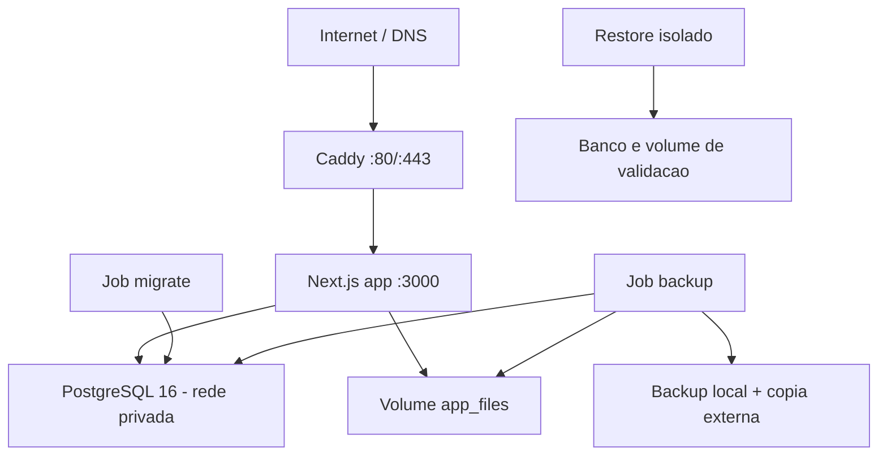

# Deploy

## Topologia de referencia



O Compose de referencia publica apenas 80/443. A aplicacao e o PostgreSQL ficam
em rede privada. A imagem roda como usuario `nextjs`, com filesystem read-only e
volume gravavel apenas para arquivos privados.

## Arquivos

- `Dockerfile`;
- `docker-compose.production.yml`;
- `Caddyfile`;
- `.env.example`;
- `scripts/release.sh`;
- `scripts/rollback.sh`;
- `scripts/backup.sh`;
- `scripts/restore.sh`;
- `scripts/migrate.mjs`;
- `scripts/bootstrap.mjs`.

O procedimento detalhado de host, DNS e hardening esta em
`docs/DEPLOYMENT-SERVER.md`.

## Pre-requisitos

- Linux suportado e atualizado;
- Docker Engine e Compose v2;
- dominio apontando para o servidor;
- portas 80/443;
- SSH por chave e acesso administrativo restrito;
- destino externo criptografado para backup;
- PostgreSQL local do Compose ou servico gerenciado previamente validado;
- credenciais em secret store/arquivo modo 600.

Capacidade inicial sugerida no piloto: 4 vCPU, 8 GB RAM e 80 GB SSD, a ser
ajustada por medicao.

## Preparacao

```bash
git clone <repositorio> /opt/bbt-corporativo
cd /opt/bbt-corporativo
cp .env.example .env.production
chmod 600 .env.production
```

Preencha `.env.production` sem reutilizar as credenciais de exemplo. O papel de
aplicacao deve ser diferente do papel de migration e nao pode ter
`SUPERUSER`/`BYPASSRLS`.

```bash
node scripts/validate-environment.mjs --env-file=.env.production
docker compose --env-file .env.production -f docker-compose.production.yml config
```

## Release

```bash
ENV_FILE=.env.production ./scripts/release.sh
```

O release:

1. valida ambiente e codigo;
2. executa validacoes/migrations estaticas;
3. cria backup;
4. constroi imagem;
5. aplica migrations com papel administrativo;
6. sobe a aplicacao;
7. verifica health/readiness/smoke.

Migrations nao devem ser executadas pelo papel web.

## Bootstrap

Uma unica vez:

```bash
docker compose --env-file .env.production \
  -f docker-compose.production.yml \
  --profile bootstrap run --rm bootstrap
```

O bootstrap cria tenant, plano, papeis, administrador e rollouts iniciais. A
senha precisa atender a politica forte. Depois do sucesso:

- remova `BOOTSTRAP_ADMIN_PASSWORD`;
- rotacione quando a senha tiver sido compartilhada;
- use convite individual para os demais usuarios;
- nunca crie credencial compartilhada.

## Verificacao

```bash
docker compose --env-file .env.production -f docker-compose.production.yml ps
curl --fail https://SEU_DOMINIO/api/health
curl --fail https://SEU_DOMINIO/api/ready
node --env-file=.env.production scripts/smoke-test.mjs
```

Valide login, tenant, empresa/grupo, negacoes, persistencia apos reinicio,
arquivos privados, relatorios, convite/reset e integracoes habilitadas.

## Atualizacao

1. Use `APP_VERSION` imutavel.
2. Revise migration e compatibilidade retroativa.
3. Confirme backup e espaco.
4. Execute release.
5. Monitore 5xx, latencia, banco e filas por pelo menos 30 minutos.
6. Expanda a liberacao gradualmente quando houver varios tenants.

Schema deve seguir expandir/contrair. Rollback de imagem nao desfaz migration.

## Rollback

```bash
PREVIOUS_APP_VERSION=<tag-anterior> \
ENV_FILE=.env.production \
./scripts/rollback.sh
```

Se o schema nao for retrocompativel, interrompa o rollback simples e siga o
procedimento aprovado de restauracao em `docs/BACKUP-RESTORE.md`.

## Volumes

- `postgres_data`;
- `app_files`;
- `backup_data`;
- `caddy_data`;
- `caddy_config`;
- `restore_validation_files`.

Nunca execute `docker compose down -v` em producao.

## Observabilidade minima

Alertas:

- `/api/ready` indisponivel;
- HTTP 5xx e latencia p95;
- falhas/reinicios;
- pool, locks e disco PostgreSQL;
- disco 75%/85%;
- backup acima do RPO;
- certificado proximo do vencimento;
- SMTP, Tech, IA e WhatsApp;
- aumento anormal de login negado.

Sem coleta externa, alertas e restore medido, o ambiente e `NO-GO`.
