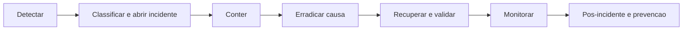

# Resposta a incidentes

## Objetivo

Definir resposta repetivel para indisponibilidade, perda, exposicao ou
integridade incorreta. O guia operacional de sintomas esta em `docs/RUNBOOK.md`;
este documento define governanca e evidencias.

## Severidade

| Nivel | Exemplo | Acao inicial |
| --- | --- | --- |
| SEV-1 | Vazamento entre tenants, perda ampla, indisponibilidade total | Conter imediatamente e acionar direcao/seguranca |
| SEV-2 | Funcao critica indisponivel, financeiro inconsistente | Plantao tecnico e dono do negocio |
| SEV-3 | Degradacao parcial com contorno | Priorizar correcao e monitorar |
| SEV-4 | Defeito sem impacto operacional imediato | Backlog com prazo |

## Papeis

- comandante: coordena decisoes e horario;
- tecnico: investiga e executa contencao;
- negocio: avalia impacto operacional/financeiro;
- seguranca/LGPD: avalia dados pessoais e notificacao;
- comunicacao: atualiza usuarios sem expor detalhes;
- registrador: mantem linha do tempo e evidencias.

Uma pessoa pode acumular papeis no piloto, mas as responsabilidades precisam
estar declaradas.

## Fluxo

## Registro minimo

- ID e severidade;
- inicio/deteccao/contencao/recuperacao;
- versao e ambiente;
- tenants e empresas afetados;
- impacto e dados envolvidos;
- request IDs, logs e eventos de auditoria;
- alteracoes/migrations recentes;
- decisoes, aprovadores e executor;
- RPO/RTO medidos;
- causa raiz e acoes preventivas.

Nao copie senha, token, CPF completo, documento ou arquivo pessoal para ticket.

## Contencao

### Possivel acesso cruzado

1. Coloque o sistema em manutencao ou bloqueie o modulo.
2. Preserve logs e banco sem alterar evidencias.
3. Revogue sessoes potencialmente envolvidas.
4. Confirme papel PostgreSQL, `app.tenant_id`, RLS e endpoint.
5. Nao reabra ate executar teste cruzado com papel sem bypass.

### Credencial comprometida

1. Revogue no provedor.
2. Rotacione no secret store.
3. Revogue sessoes quando envolver auth/cookie.
4. Reinicie somente consumidores necessarios.
5. Audite periodo e escopo.

### Dados financeiros incorretos

1. Suspenda conciliacao/baixa automatica.
2. Preserve lancamentos e eventos.
3. Compare origem, checksum e idempotencia.
4. Corrija por lancamento compensatorio/auditavel; nao edite historico sem trilha.

### Integracao ambigua

1. Nao repita emissao/reserva cegamente.
2. Consulte OS/localizador/status.
3. Trave a operacao como pendente.
4. Reconcile com fornecedor antes de nova tentativa.

## Recuperacao

- use imagem versionada;
- restaure primeiro em ambiente isolado;
- valide banco e arquivos do mesmo ponto;
- execute migrations/status, readiness e smoke;
- confirme login e isolamento;
- confirme totais e registros afetados;
- libere gradualmente;
- monitore por janela definida.

## Comunicacao

Atualizacoes devem informar:

- impacto conhecido;
- contencao aplicada;
- proxima atualizacao;
- orientacao ao usuario;
- horario em timezone explicita.

Nao atribua causa antes de evidencia. Incidente de dados pessoais deve ser
avaliado com juridico/encarregado conforme obrigacoes aplicaveis.

## Pos-incidente

Em ate cinco dias uteis para SEV-1/SEV-2:

- linha do tempo;
- causa tecnica e sistemica;
- por que controles nao detectaram;
- impacto confirmado;
- acao corretiva com responsavel/prazo;
- teste de regressao;
- melhoria de monitoramento/runbook;
- decisao sobre notificacao.

Nao encerrar somente porque o servico voltou.
