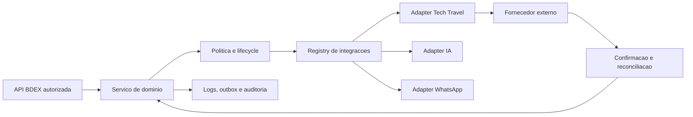

# Integracoes

## Arquitetura



Regras comuns:

- segredos somente no servidor;
- tenant, empresa e permissao derivados da sessao;
- timeout;
- validacao Zod;
- payload sensivel mascarado em logs;
- idempotencia em operacoes mutaveis;
- resposta externa nao reconhecida gera erro;
- sucesso somente apos confirmacao do fornecedor;
- operacao ambigua permanece pendente para reconciliacao.

Retry nao e uma regra unica para todas as operacoes. Consultas idempotentes
podem receber retry/backoff limitado depois da homologacao. Reserva, emissao,
cancelamento e reembolso nao podem ser repetidos automaticamente enquanto o
fornecedor nao confirmar contrato de idempotencia e consulta de reconciliacao.
O repositorio ainda nao possui circuit breaker distribuido.

## Tech Travel - relatorios

Configuracao:

```dotenv
TECH_REPORTS_ENABLED=true
TECH_REPORTS_BASE_URL=https://www.ttravel.com.br/ttravelapi/relatorio
TECH_REPORTS_KEY=<segredo>
```

`POST /api/integrations/tech/emissions` consulta `/Emissao`, aceita periodo ISO
de ate 366 dias, converte para `DD/MM/YYYY`, valida a resposta e normaliza as
emissoes. A rota exige sessao, administrador do tenant, permissao de importacao
e rate limit.

O token compartilhado anteriormente deve ser tratado como comprometido e
rotacionado antes de producao. Ele nao esta gravado no repositorio.

## Tech Travel - transacional

Configuracao separada:

```dotenv
TECH_API_ENABLED=true
TECH_API_MODE=production
TECH_API_BASE_URL=https://www.ttravel.com.br/ttravelapi/reservas
TECH_API_LOGIN=<segredo>
TECH_API_PASSWORD=<segredo>
TECH_API_KEY=<segredo>
```

O adapter possui codigo para:

- login, selecao/lista de empresa;
- cidades;
- disponibilidade aerea e hotel;
- tarifacao;
- reserva aerea e hotel;
- consulta de OS e reserva;
- emissao;
- cancelamento de reserva e bilhete;
- politicas, centros de custo, motivos e campos adicionais;
- bilhetes reutilizaveis e verificacao de churning.

Isso representa capacidade implementada, nao homologacao. Cotacao, reserva,
emissao e cancelamento permanecem `NO-GO` ate existirem:

- credenciais transacionais completas;
- contrato oficial dos endpoints/payloads;
- ambiente sandbox ou tenant controlado;
- exemplos de sucesso e falha;
- regras de idempotencia confirmadas com o fornecedor;
- consulta/reconciliacao de operacao ambigua;
- teste de cancelamento e estorno;
- aprovacao operacional.

Servicos sem endpoint documentado retornam `501`, sem resposta ficticia.

## Mapeamento de empresas e atores

IDs externos nao sao aceitos como `company_id` interno. O sistema usa:

- `integration_company_mappings`;
- aliases externos por empresa;
- mapeamentos de empresa em emissao;
- `integration_actor_mappings`;
- mapeamento de emissor Wintour.

Cada associacao inclui tenant e validacao da empresa interna. Mapeamento ausente
deve ir para conciliacao, nao para a primeira empresa disponivel.

## Wintour - importacao e sincronizacao de vendas

O fluxo de entrada Wintour → BDEX:

- recebe CSV/XLSX/PDF conforme o importador;
- normaliza campos;
- usa documento, e-mail, matricula, ID e aliases de pessoa;
- registra historico de importacao;
- evita duplicidade por indices e chaves de origem;
- permite vinculacao manual quando a confianca e insuficiente;
- preserva nome informado como snapshot, usando `employee_id` como identidade.

Reimportacao nao deve apagar dados anteriores. Rollback usa snapshots de
entidades criadas pelo job.

O fluxo de saida BDEX → Wintour e independente do importador. Emissoes
finalizadas entram numa fila propria, recebem um `idv_externo` numerico estavel,
sao validadas contra o layout v4 e podem ser baixadas como XML ou transmitidas
por SOAP. Alteracoes pos-emissao usam o layout DGR-046, somente com os campos
permitidos e com o numero da venda Wintour previamente reconciliado.

Na cobertura inicial, a preparacao automatica e restrita a emissao aerea
`manual-offline`, uma venda por bilhete e BRL, com todos os dados reconstruidos
de fontes relacionais verificaveis. Hotel, Locacao, Rodoviario e qualquer caso
financeiro ambiguo permanecem bloqueados ate mapeamento e homologacao proprios.

O protocolo retornado por `importaArquivo2` ou `alteraVendas` confirma apenas o
recebimento na fila. O job so pode ser considerado concluido depois da consulta
de protocolo ou conciliacao humana. Timeout ou conexao interrompida depois do
envio produz estado ambiguo e nunca dispara retry automatico. Cada reenvio
manual cria uma nova tentativa e preserva todos os protocolos anteriores.

O PIN fica exclusivamente no ambiente do servidor e deve ser vinculado a um
unico tenant por `WINTOUR_TENANT_ID`; o worker recusa reutiliza-lo em outro
tenant. XML, snapshots de origem e dados de passageiros nao entram na listagem
JSON nem nos logs operacionais.
Consulte [Sincronizacao Wintour](./WINTOUR-OUTBOUND-SYNC.md) para ativacao e
limitacoes de homologacao.

## IA

OpenAI/Gemini sao opcionais e configurados por ambiente. O servidor limita
entrada, guarda configuracao por tenant e nao executa acao sensivel apenas pela
resposta do modelo.

Tarefas de agente que envolvem cotacao ou aprovacao sao artefatos consultivos e
exigem guard/permissao e confirmacao humana. Ausencia de credencial retorna erro
explicito.

## WhatsApp

O adapter e opcional. Sem provedor habilitado, o sistema nao registra envio
real como sucesso. Antes do go-live, validar:

- credencial e instancia;
- opt-in/base legal;
- template e destino;
- entrega e falha;
- rate limit;
- retencao de logs sem conteudo sensivel excessivo.

## SMTP

Convites e reset de senha dependem de SMTP. Nao existe senha padrao por e-mail.
Teste obrigatorio: entrega, link unico, expiracao, uso unico e auditoria.

## Mapas e tiles

Os relatorios usam Leaflet. Tiles online dependem de rede, termos e capacidade
do provedor. Exportacao HTML deve ter fallback quando o destinatario estiver
offline; dados de localizacao continuam sujeitos ao escopo autorizado.

## Observabilidade

`integration_action_logs`, `domain_outbox`, eventos de webhook e logs
estruturados registram:

- fornecedor/acao;
- request ID;
- estado;
- duracao;
- entidade;
- metadados sanitizados.

Senha, token e documento completo nao devem aparecer em logs.

## Aceite

Cada integracao deve passar por:

1. teste de configuracao;
2. sucesso;
3. credencial invalida;
4. timeout;
5. resposta invalida;
6. repeticao/idempotencia;
7. operacao ambigua;
8. revogacao;
9. auditoria;
10. reconciliacao.

Sem essas evidencias, a integracao permanece desabilitada em producao.

## Matriz de homologacao

| Integracao | Adapter real | Timeout/schema | Idempotencia | Retry/backoff | Circuit breaker | Auditoria | Teste externo | Status |
| --- | --- | --- | --- | --- | --- | --- | --- | --- |
| Tech Reports | Sim | Sim | Consulta por periodo | Nao homologado | Nao | Sim | Nao executado | Desabilitada |
| Tech transacional | Sim | Sim | Chave nas mutacoes | Nao repetir mutacao automaticamente | Nao distribuido | Sim | Nao executado | Desabilitada |
| Wintour/importacao | Parser local | Sim | Job/fingerprint/snapshot | Reprocessamento controlado | Nao aplicavel | Sim | Parcial por arquivo | Piloto controlado |
| Wintour/sincronizacao de vendas | SOAP + XML, desabilitado por padrao | Sim | ID externo estavel + snapshot | Sem retry automatico em ambiguidade | Nao distribuido | Sim | Pendente PIN/homologacao | Implementada, nao homologada |
| SMTP | Sim | Erros tipados | Token unico | Biblioteca/servidor | Nao | Sim | Nao executado | Desabilitada |
| OpenAI/Gemini | Sim | Limites e erro explicito | Nao executa mutacao critica | Provedor | Nao distribuido | Sim | Nao executado | Opcional/desabilitada |
| WhatsApp | Interface/adaptador opcional | Parcial | Evento de envio | Nao homologado | Nao | Sim | Nao executado | Desabilitada |
| Mapas/tiles | Leaflet | Resposta do tile | Nao aplicavel | Navegador | Nao aplicavel | Snapshot | Nao executado | Validacao pendente |
| Webhook de entrada | Nao | Nao | Tabela preparada | Nao | Nao | Tabela preparada | Nao executado | Nao implementado |
| GDS | Nao | Nao | Nao | Nao | Nao | Nao | Nao | Nao implementado |
| NDC | Nao | Nao | Nao | Nao | Nao | Nao | Nao | Nao implementado |
| Locadoras | Nao dedicado | Nao | Nao | Nao | Nao | Catalogo apenas | Nao | Nao implementado |
| Contabilidade/ERP | Nao | Nao | Nao | Nao | Nao | Nao | Nao | Nao implementado |

Uma linha somente pode mudar para `Homologada` com evidencia anexada de todos os
dez passos de aceite. Interface, configuracao ou tabela isolada nao contam como
integracao funcional.
