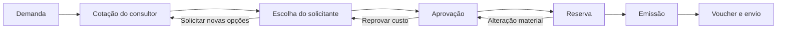

# Reformulação do fluxo offline e dos cadastros de hotel

## Objetivo

Transformar o atendimento offline em um processo governado por demanda, com separação explícita entre solicitação, cotação, escolha, aprovação, reserva, emissão e entrega do voucher. O desenho atende hotel, aéreo, carro, rodoviário, transfer, seguro, pacote e outros serviços, preservando os conectores online existentes.

Esta implementação é aditiva e modular. Os novos módulos usam PostgreSQL, RLS por tenant, auditoria, controle otimista de versão e eventos de ciclo de vida. As telas legadas permanecem disponíveis durante a validação local e não devem ser removidas antes da migração e conciliação dos dados.

## 1. Base geográfica

### Fonte

A fonte inicial é a API oficial de Localidades do IBGE:

- países: `/api/v1/localidades/paises`;
- estados: `/api/v1/localidades/estados`;
- municípios: `/api/v1/localidades/municipios`.

O IBGE é a autoridade para estados e municípios brasileiros. Países são armazenados com os códigos oficiais fornecidos pelo conjunto de dados, além de ISO quando disponível.

### Como a aplicação consome

A aplicação não consulta o IBGE ao abrir um formulário. Países, estados e cidades são lidos do PostgreSQL local. Assim, uma indisponibilidade externa não bloqueia a criação de uma demanda ou reserva.

### Como a base é atualizada

1. Um administrador inicia a sincronização pela tela de fornecedores/base geográfica ou por uma rotina agendada.
2. O backend baixa os três conjuntos de dados.
3. O lote é normalizado e validado antes de alterar a versão ativa.
4. A validação verifica contagens mínimas, IDs oficiais, duplicidades, encoding e relações cidade → estado → país.
5. Um checksum SHA-256 identifica exatamente o conteúdo recebido.
6. A importação faz `upsert` pelos identificadores oficiais.
7. Registros ausentes somente são marcados como inativos depois que todo o lote foi validado.
8. Renomeações podem ser preservadas como aliases de busca.
9. A execução, as quantidades e eventuais erros ficam registradas em `geo_sync_runs`.
10. Se qualquer etapa falhar, a transação é revertida e a última versão íntegra continua ativa.

### Tabelas

- `geo_dataset_versions`: versão, checksum e data de referência;
- `geo_countries`: países;
- `geo_subdivisions`: estados, províncias e equivalentes;
- `geo_cities`: cidades e municípios;
- `geo_city_aliases`: nomes alternativos e históricos;
- `geo_sync_runs`: histórico auditável da sincronização.

Nenhuma cidade referenciada por hotel, demanda ou endereço é apagada fisicamente.

## 2. Fornecedor comercial e hotel

Fornecedor comercial não é o mesmo que conector de API:

- `integration_providers` continua representando Tech Travel e outros conectores técnicos;
- `commercial_suppliers` representa a entidade fiscal/comercial que vende ou intermedeia o serviço;
- `hotels` representa a propriedade física;
- `hotel_suppliers` permite que vários fornecedores comercializem o mesmo hotel e que um fornecedor comercialize vários hotéis.

### Cadastro de fornecedor

Campos principais:

- código interno;
- razão social e nome fantasia;
- CNPJ, CPF ou identificador estrangeiro;
- tipos de serviço atendidos;
- contatos comercial, reservas, financeiro e emergência;
- condições de pagamento;
- status ativo, inativo ou bloqueado;
- endereço e observações;
- versão e auditoria.

### Cadastro de hotel

Campos principais:

- nome e nome normalizado;
- país, estado e cidade do catálogo oficial;
- endereço, telefone, e-mail e website;
- categoria e comodidades;
- dados de faturamento;
- fornecedores habilitados;
- tipos de quarto e capacidades;
- identificador legado para conciliação;
- status, versão e auditoria.

Tarifa não pertence diretamente ao hotel. Ela pertence à combinação fornecedor + propriedade + quarto + vigência + moeda e, por isso, é modelada separadamente.

## 3. Nova demanda de hotel

A demanda informa a necessidade do cliente; ela não contém localizador, confirmação, fornecedor escolhido ou valor final de reserva.

### Dados da solicitação

- empresa e centro de custo;
- solicitante;
- destino oficial: país, estado e cidade;
- check-in e check-out;
- quantidade de quartos;
- ocupação de cada quarto;
- viajantes/hóspedes;
- faixa etária das crianças;
- acessibilidade e preferências;
- hotel preferencial opcional;
- observações.

### Ocupação e hóspedes

Cada quarto cria automaticamente os slots obrigatórios:

- `SGL`: um responsável;
- `DBL/CASAL`: um responsável e um acompanhante;
- `TWIN`: dois hóspedes;
- `TPL`: um responsável e dois hóspedes;
- `QDP`: um responsável e três hóspedes;
- `FAM`: composição configurável com adultos e crianças.

O hóspede interno é pesquisado na base relacional de viajantes ativos da empresa. Um acompanhante externo pode ser informado apenas quando a política permitir, com nome, documento e vínculo. A mesma pessoa não pode ocupar dois slots incompatíveis no mesmo período.

### Persistência

- `hotel_demand_details`: destino, período e preferências;
- `hotel_demand_rooms`: quartos e tipo de ocupação;
- `hotel_demand_room_guests`: associação hóspede/slot;
- `demand_travelers`: viajantes da demanda e snapshots necessários;
- `hotel_occupancy_types` e `hotel_occupancy_slots`: regras configuráveis de ocupação.

Dados históricos sem estrutura suficiente permanecem disponíveis e são marcados para revisão; não se inventa automaticamente um hóspede ou preço.

## 4. Fluxo operacional offline



### 4.1 Demanda

O solicitante registra somente a necessidade. Uma demanda externa entra sem ser atribuída ao próprio solicitante; ela segue para a fila de consultores.

Estado esperado: `draft → submitted → approved_for_quotation → quoting`.

### 4.2 Cotação

O consultor pode cadastrar várias opções offline para todos os serviços. Cada opção guarda:

- fornecedor;
- produto/serviço;
- datas e horários;
- composição do preço em centavos;
- impostos, taxas, adicionais e descontos;
- validade;
- política de cancelamento;
- forma de pagamento;
- detalhes específicos do serviço.

Para hotel, a cotação inclui propriedade, quartos, tarifa por diária, número de diárias e taxas por quarto ou por hospedagem.

Depois da publicação, a cotação fica imutável. Uma alteração cria nova revisão.

Estado esperado: `quoting → pending_choice`.

### 4.3 Escolha

O solicitante compara as opções, escolhe uma e confirma os viajantes. A escolha gera `travel_quote_selections` com snapshot e hash imutáveis. Existe apenas uma escolha ativa por demanda.

Estado esperado: `pending_choice → pending_cost_approval` ou, quando a política dispensa aprovação, `pending_choice → approved`.

### 4.4 Aprovação

O aprovador recebe exatamente a opção escolhida, incluindo fornecedor, datas, viajantes, quartos, preço detalhado, política de cancelamento e centro de custo. A aprovação aponta para o hash da escolha, evitando que o preço seja alterado depois da decisão.

Se houver reprovação de custo, a demanda retorna para escolha ou recotação, sem ficar presa em um estado intermediário.

Estado esperado: `pending_cost_approval → approved`.

### 4.5 Reserva

Somente uma opção aprovada pode ser reservada. O consultor registra localizador, confirmação, prazo, fornecedor e detalhes operacionais. A tela permite salvar rascunho e continuar depois.

Uma correção de reserva exige:

- versão esperada (`expectedVersion`);
- motivo obrigatório;
- snapshot antes/depois;
- identificação do operador;
- recálculo pelo backend;
- bloqueio de edição direta depois da emissão.

Alterações não materiais, como observação operacional, podem ser aplicadas imediatamente. A entrega local atual já classifica e audita a alteração como material quando muda preço, datas, viajantes, fornecedor, produto ou política de cancelamento. A etapa seguinte da reformulação conectará essa classificação à recotação/reaprovação automática e bloqueará a emissão até a nova decisão; enquanto isso, a trilha antes/depois permite validar o comportamento sem perder dados.

Estados esperados: `approved → reserving → reserved → pending_issuance`.

### 4.6 Emissão

A emissão recebe uma reserva existente; não cria outra reserva silenciosamente. Ela registra bilhete/localizador, custos finais e documentos. Todos os valores são calculados e comparados em centavos.

Estados esperados: `pending_issuance → issuing → issued`.

### 4.7 Voucher e entrega

Após a emissão, o sistema gera um arquivo persistido e congela os destinatários:

- solicitante;
- viajantes/hóspedes;
- contatos adicionais autorizados.

`voucher_deliveries` registra canal, tentativa, status, erro e confirmação. Reenvios são idempotentes. Criar um evento de notificação não equivale a confirmar a entrega.

## 5. Tela do fluxo offline

A tela de reservas deve deixar de ser um único formulário que mistura todas as etapas. O novo workspace é organizado por OS/demanda:

1. **Solicitação**: resumo da necessidade, empresa, viajantes e centro de custo;
2. **Cotações**: opções e revisões cadastradas pelo consultor;
3. **Escolha**: opção selecionada e hash do snapshot;
4. **Aprovação**: instância, aprovadores, prazo e decisão;
5. **Reserva**: dados do fornecedor, localizador, confirmação e correções;
6. **Emissão**: documentos e valores finais;
7. **Voucher/Envio**: geração, destinatários e tentativas de entrega.

O cabeçalho apresenta um stepper e indica a etapa atual. Cada perfil vê apenas as ações permitidas:

- solicitante: criar demanda, comparar opções e escolher;
- aprovador: aprovar ou devolver;
- consultor: cotar, reservar e emitir conforme suas permissões;
- auditor/gestor: consultar timeline e revisões, sem alterar o registro.

As filas são separadas por ação necessária: aguardando cotação, aguardando escolha, aguardando aprovação, aguardando reserva, aguardando emissão e falha de voucher.

## 6. Cálculo monetário

Valores são recebidos, persistidos e calculados em centavos inteiros:

```text
subtotal = valor_unitario_centavos × quantidade
total = subtotal + taxas + adicionais - descontos
```

Para hotel:

```text
diarias = check_out - check_in
subtotal_quarto = tarifa_diaria_centavos × diarias
total_hospedagem = soma(subtotais_quartos) + taxas + adicionais - descontos
```

O total é somente leitura na interface. Isso elimina diferenças como `1.199,99 + 120,00 = 1.320,00` e impede a emissão de um valor diferente da reserva aprovada.

## 7. Módulos técnicos

- `lib/geography` e `lib/server/geography-service`;
- `lib/commercial-suppliers` e `lib/server/commercial-supplier-service`;
- `lib/hotel-catalog` e `lib/server/hotel-catalog-service`;
- `lib/hotel-demand` e `lib/server/hotel-demand-service`;
- `lib/server/offline-quote-service`;
- `lib/server/offline-selection-service`;
- `lib/server/offline-reservation-service`;
- `lib/server/offline-issuance-service`;
- `lib/server/voucher-delivery-service`.

Essa separação evita que uma mudança no cadastro de hóspedes altere emissão, ou que uma correção de reserva afete conectores online.

## 8. Estratégia de implantação

1. Desenvolver e migrar somente a base local.
2. Validar cadastros e simular o fluxo completo com solicitante, aprovador e emissor.
3. Versionar a branch de staging após aprovação local.
4. Aplicar e testar no staging da VPS.
5. Conciliar os hotéis legados pelo identificador numérico, nome normalizado e cidade.
6. Liberar o novo fluxo por feature flag e manter o legado apenas para consulta.
7. Promover Git de produção e VPS de produção somente após aprovação no staging.

Nenhuma migration já aplicada deve ser modificada depois da publicação. Ajustes posteriores usam uma nova migration.
