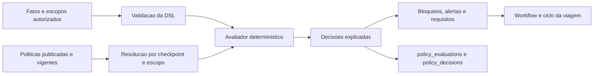

# Motor de politicas

## Objetivo

O motor de politicas transforma regras corporativas versionadas em decisoes
deterministicas, explicaveis e auditaveis. Ele nao substitui autorizacao RBAC,
RLS, workflow de aprovacao ou a maquina de estados da viagem. Cada camada resolve
um problema diferente:

- RBAC e acesso corporativo definem quem pode executar ou consultar uma acao;
- RLS impede leitura e escrita entre tenants no PostgreSQL;
- politicas avaliam regras de negocio para um contexto e checkpoint;
- aprovacao resolve pessoas, alcadas, delegacoes e decisoes;
- ciclo da viagem controla a transicao operacional permitida.

## Componentes

| Componente | Responsabilidade |
| --- | --- |
| `lib/policy/schema.ts` | Validacao Zod da DSL e dos limites de entrada |
| `lib/policy/operators.ts` | Operadores deterministas e conversoes seguras |
| `lib/policy/evaluator.ts` | Escopo, heranca, avaliacao, explicacao e hashes |
| `lib/policy/conflicts.ts` | Conflitos, dependencias e sobreposicoes |
| `lib/policy/templates/catalog.ts` | Catalogo interno parametrizado por segmento |
| `lib/policy/templates/argo-benchmark.ts` | Matriz rastreavel das areas do PDF ARGO |
| `lib/server/policy-service.ts` | Persistencia, RBAC, publicacao, simulacao e auditoria |
| `app/api/policies/**` | API administrativa e de simulacao |
| `components/policies/policy-visual-builder.tsx` | Construtor visual de condicoes, acoes, escopos e dependencias |
| migrations `0008`, `0010` e `0016` | Modelo relacional, hardening e checkpoints |

## Fluxo de administracao

1. Um usuario com `gerenciar_politicas` cria um rascunho no escopo permitido.
2. Cada alteracao cria uma versao imutavel; a definicao guarda o estado corrente.
3. O servidor valida schema, escopos, dependencias, periodo e conflitos.
4. `publicar_politicas` e obrigatoria para publicar.
5. A publicacao registra auditoria e torna a versao elegivel para avaliacao.
6. Suspender ou arquivar nao apaga versoes nem decisoes anteriores.

O cliente nunca define o tenant autoritativo. O servico usa o principal da
sessao e chama os guards de grupo/empresa conforme o escopo.

## Resolucao de aplicabilidade

Uma politica e candidata somente quando:

- esta publicada;
- esta dentro de `validFrom` e `validUntil`;
- declara o checkpoint atual ou `*`;
- possui ao menos um escopo `include` correspondente;
- nao possui escopo `exclude` correspondente.

Politicas candidatas sao ordenadas por especificidade e prioridade. Os modos de
heranca suportados sao:

- `inherit`: mantem a politica herdada;
- `merge`: combina com as demais politicas aplicaveis;
- `override`: remove versoes sobrescreviveis menos especificas da mesma categoria;
- `replace`: substitui a categoria no escopo correspondente;
- `disable`: desabilita a categoria coberta;
- `stop_inheritance`: interrompe politicas menos especificas daquela categoria.

O comportamento exato esta protegido por `tests/unit/policy-engine.test.ts`.

## Resultado

Cada avaliacao retorna:

- `passed`;
- erros e alertas;
- justificativas e aprovacoes requeridas;
- bloqueios;
- documentos e outras acoes requeridas;
- politicas e versoes aplicadas;
- alternativas e remediacoes;
- arvore de explicacao por condicao;
- `factsHash`, `resultHash` e `evaluationId`;
- checkpoint, horario e modo.

Falha de operador nao vira permissao silenciosa. Ela aparece na explicacao e
produz item de erro para impedir que uma regra invalida seja tratada como sucesso.

## Modos

| Modo | Uso | Efeito |
| --- | --- | --- |
| `enforce` | Operacao real | Resultado participa da decisao operacional |
| `shadow` | Comparacao de rollout | Registra resultado sem substituir a decisao vigente |
| `simulation` | Administracao/teste | Avalia candidato e registra impacto quando solicitado |

Simulacao nao publica politica e nao autoriza reserva ou emissao.

## Conflitos

Antes da publicacao sao analisados:

- definicao sem escopo ou sem acao;
- dependencia obrigatoria ausente;
- ciclo de dependencias;
- conteudo duplicado;
- acoes contraditorias no mesmo checkpoint/escopo;
- versoes com vigencia sobreposta;
- politica sombreada por `replace`.

Conflitos bloqueantes impedem a publicacao. Avisos permanecem visiveis e
auditaveis.

## Persistencia e auditoria

As migrations criam tabelas separadas para definicoes, versoes, escopos,
condicoes, acoes, excecoes, dependencias, conflitos, publicacoes, avaliacoes,
decisoes, violacoes, simulacoes, testes e auditoria de alteracoes.

As tabelas de tenant usam RLS. Referencias compostas com `tenant_id` impedem
associacao cruzada mesmo que um identificador seja manipulado.

## Integracao operacional

O ciclo de viagem exige uma avaliacao aprovada em transicoes sensiveis. A
avaliacao e a versao de politica ficam vinculadas ao historico da demanda. Uma
alteracao material posterior pode exigir nova avaliacao e nova aprovacao; a
decisao anterior nao e apagada.

## Evidencias automatizadas

- `tests/unit/policy-engine.test.ts`
- `tests/unit/policy-template-catalog.test.ts`
- `tests/unit/policy-admin-schema.test.ts`
- migrations validadas por `npm run db:validate-migrations`
- API e build validados por `npm run typecheck`, `npm run lint` e `npm run build`

O teste PostgreSQL/RLS exige `TEST_DATABASE_URL` com papel sem `SUPERUSER` e sem
`BYPASSRLS`. Esse gate passou localmente em 24/07/2026 e permanece obrigatorio
no CI e em staging.
