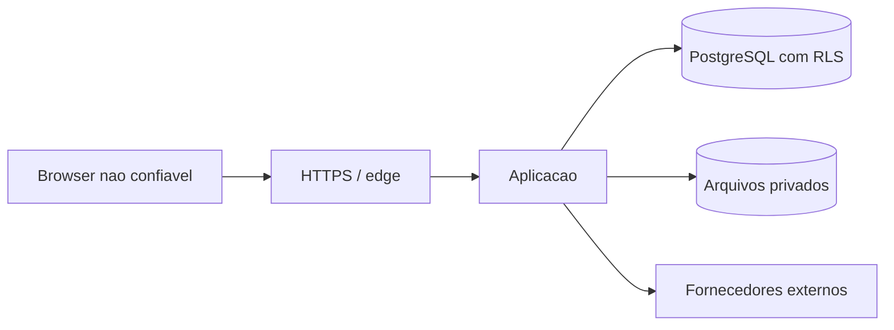

# Modelo de ameacas

## Ativos

- identidades, hashes de senha, sessoes e convites;
- dados de empresas, viajantes e documentos;
- demandas, reservas, emissoes e vouchers;
- financeiro, cartoes tokenizados, faturas e relatorios;
- politicas, aprovacoes e trilha de auditoria;
- segredos de SMTP, IA e fornecedores.

## Fronteiras de confianca

O navegador pode escolher um contexto visual, mas nao define tenant, empresas permitidas,
perfil, permissao ou resultado de politica.

## Ameacas e controles

| Ameaca | Controle principal | Evidencia | Risco residual |
| --- | --- | --- | --- |
| IDOR entre empresas | `requireCompanyAccess` e escopo efetivo | unitarios, integracao corporate access e smoke anonimo | E2E de todos os perfis ainda e ampliavel |
| Acesso entre tenants | sessao + RLS forcado + FK composta | 45 testes PostgreSQL, incluindo identity plane RLS | repetir no PostgreSQL de staging |
| Elevacao por papel legado | permissoes por operacao e origem do grant | teste viewer-all/owner-direct | revisao continua |
| Roubo de sessao | token opaco, cookie HttpOnly/Secure, revogacao | unitario e configuracao | depende de HTTPS real |
| Forca bruta | rate limit, contador e bloqueio | servico de autenticacao | rate limit depende do PostgreSQL |
| CSRF | SameSite, validacao de origem em mutacoes | guard de API | proxy deve preservar host/proto |
| XSS | React, CSP nonce e sem HTML arbitrario | build/E2E CI | conteudo externo deve ser sanitizado |
| SQL injection | queries parametrizadas e IDs validados | revisao e testes | SQL dinamico limitado a allowlists |
| SSRF | allowlist/base URL de adapters | servicos de integracao | homologacao externa pendente |
| Upload malicioso | MIME, assinatura, tamanho, nome e storage privado | file service | antivirus depende de infraestrutura |
| Replay externo | idempotencia, webhook event e timestamp | schema/servicos | cada fornecedor precisa homologacao |
| Vazamento em logs | logger estruturado com redacao | scanner/testes | revisar novos adapters |
| Corrupcao concorrente | transacao, lock e version | unitarios/constraints | carga real pendente |
| Exclusao indevida | reset com senha, staging e policy fail-closed | testes de reset | backup/restore real pendente |

## Segredos

Segredos ficam somente em variaveis de ambiente ou secret store. `.env.example` nao contem
credenciais reais. Logs, respostas e auditoria nao devem registrar tokens, cookies,
connection strings, senha ou CVV.

## Dados de cartao

O sistema nao deve armazenar CVV. Numero completo de cartao exige provedor de tokenizacao
e escopo PCI apropriado. O modelo atual deve guardar apenas token/referencia e metadados
mascarados.

## Resposta

Achados criticos exigem revogacao de sessao/segredo, preservacao de evidencias, avaliacao
de tenant afetado e registro no runbook. Consulte `INCIDENT-RESPONSE.md`.
