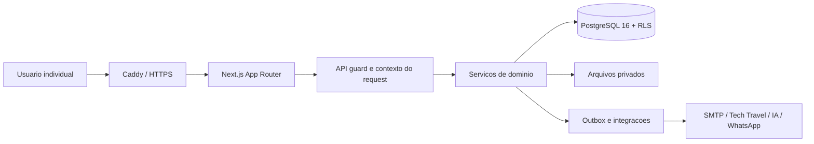
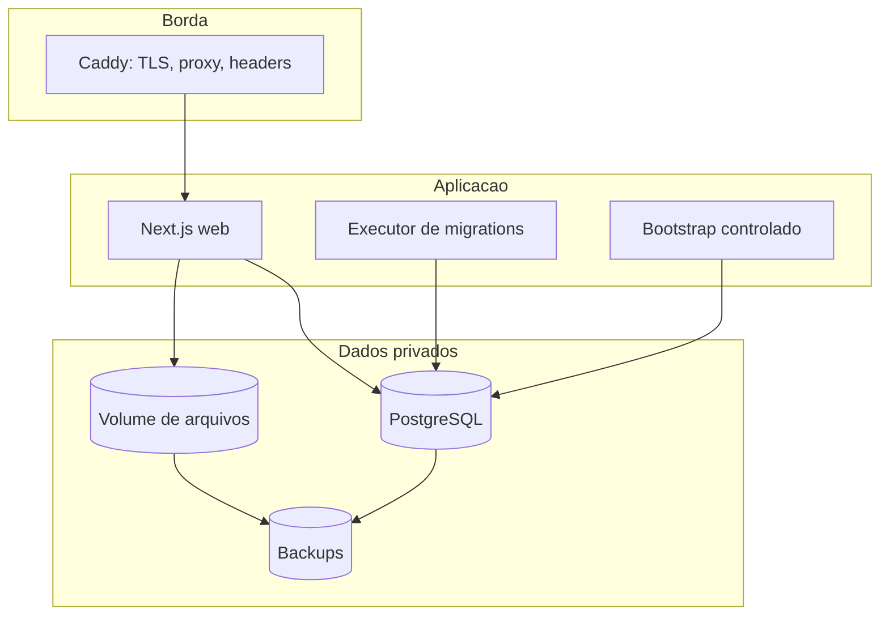
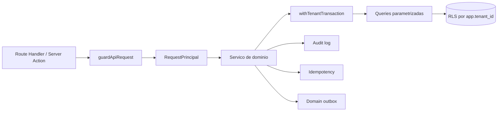

# Arquitetura do sistema

## Escopo

O BDEX Corporativo e uma aplicacao Next.js multi-tenant. O processo web nao define tenant,
empresa ou grupo a partir de valores confiados ao navegador. A identidade e o tenant saem da
sessao persistida; o escopo corporativo e recalculado no servidor.

## Containers

## Componentes internos

Responsabilidades:

- `app/`: paginas, layouts e rotas HTTP.
- `components/`: interface e contexto corporativo.
- `lib/server/`: autorizacao, servicos transacionais e persistencia.
- `lib/policy/`: DSL, operadores, avaliacao, conflito e catalogo.
- `lib/approvals/`: grafo, resolucao de aprovadores, delegacao e SLA.
- `lib/travel-lifecycle/`: maquina de estados e reaprovacao.
- `deploy/postgres/migrations/`: schema versionado e RLS.
- `scripts/`: migration runner, bootstrap, backup, restore, smoke e carga.

## Fluxo autenticado

1. O login valida e-mail e senha com bloqueio progressivo.
2. O servidor cria uma sessao opaca revogavel e envia cookie `HttpOnly`.
3. Cada request resolve usuario, membership, tenant, plano e escopo corporativo.
4. O guard valida permissao e limite antes do servico.
5. A transacao define `app.tenant_id`.
6. O servico revalida empresa, grupo, estado e versao do recurso.
7. A operacao grava evento de auditoria e, quando necessario, outbox/idempotencia.

## Persistencia

PostgreSQL e a fonte oficial. `app_kv` e `/api/storage` permanecem somente como camada
de compatibilidade durante rollout. Novos fluxos usam APIs especificas. As chaves antigas
estao classificadas em `config/storage-domain-registry.json`.

Dominios de maior risco usam rollout `legacy`, `shadow` ou `relational`, com escrita
`legacy`, `dual` ou `relational`. Nenhum corte para leitura relacional pode ocorrer sem uma
execucao shadow concluida e sem divergencias.

## Decisoes de seguranca

- conta web PostgreSQL sem `SUPERUSER` e sem `BYPASSRLS`;
- conta de migration separada;
- senha nunca armazenada ou enviada em texto claro;
- arquivo privado fora de `public`;
- URLs e IDs do cliente nunca ampliam acesso;
- integracao indisponivel nunca retorna sucesso simulado;
- configuracao de IA e relatorios salvos ficam no servidor;
- auditoria oficial e preservada no reset do tenant.

## Escala e limites atuais

Sessoes, rate limit, idempotencia, dados e auditoria sao compartilhados no PostgreSQL.
Antes de executar varias instancias, ainda sao necessarios object storage compartilhado,
worker/outbox dedicado e telemetria centralizada. Consulte `KNOWN-LIMITATIONS.md`.
