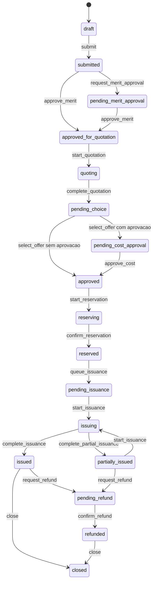

# Ciclo de vida da viagem

## Objetivo

A maquina de estados impede saltos operacionais e transforma cada mudanca em um
evento versionado e idempotente. O estado visual do frontend nao e autoritativo.

Arquivos canonicos:

- `lib/travel-lifecycle/types.ts`;
- `lib/travel-lifecycle/machine.ts`;
- `lib/travel-lifecycle/reapproval.ts`;
- `lib/server/travel-lifecycle-persistence.ts`;
- migration `0009_approval_workflow_and_travel_lifecycle.sql`.

## Fluxo principal

Estados alternativos:

- `rejected`;
- `canceled`;
- `expired`;
- `failed`.

`rejected`, `expired` e `closed` sao terminais na implementacao atual.
`canceled` pode seguir para reembolso quando existe emissao/multa que o exija.

## Pre-condicoes

### Envio

`submit` exige empresa autorizada, viajante selecionado e avaliacao de politica
aprovada.

### Aprovacao de merito

Quando requerida, precisa de instancia de workflow. A conclusao exige politica
vigente e assignments satisfeitos.

### Cotacao e escolha

Iniciar cotacao exige politica valida. Escolher oferta exige oferta real e nova
avaliacao. A presenca de uma instancia de aprovacao de custo determina se o
proximo estado e `pending_cost_approval` ou `approved`.

### Reserva

Exige:

- politicas sem bloqueio;
- aprovacoes satisfeitas;
- oferta selecionada;
- confirmacao humana explicita.

`reserved` somente e gravado depois da confirmacao do fornecedor.

### Emissao

Enfileirar emissao exige documentos e forma de pagamento. Iniciar emissao exige
politica, aprovacao e confirmacao humana. `issued` e
`partially_issued` somente sao aceitos com confirmacao do fornecedor.

### Cancelamento e reembolso

Cancelamento exige confirmacao humana. Reembolso exige politica aplicavel e
permanece pendente ate a confirmacao do fornecedor.

## Concorrencia

Cada demanda possui `version`. O comando envia `expectedVersion`; divergencia
gera `STALE_LIFECYCLE_VERSION` e obriga recarregar. Isso impede que duas abas
sobrescrevam a mesma transicao.

Cada transicao exige `idempotencyKey`, ator e horario. A persistencia usa
transacao e registra o evento junto com a nova versao.

## Falhas explicitas

Exemplos de codigos:

- `INVALID_TRAVEL_TRANSITION`;
- `POLICY_EVALUATION_REQUIRED`;
- `POLICY_BLOCKED`;
- `APPROVAL_INSTANCE_REQUIRED`;
- `APPROVAL_PENDING`;
- `HUMAN_CONFIRMATION_REQUIRED`;
- `RESERVATION_NOT_CONFIRMED`;
- `ISSUANCE_NOT_CONFIRMED`;
- `REFUND_NOT_CONFIRMED`;
- `STALE_LIFECYCLE_VERSION`.

Falha de fornecedor leva a estado pendente/erro conforme a operacao; nao e
convertida em sucesso visual.

## Reaprovacao

`lib/travel-lifecycle/reapproval.ts` compara snapshot anterior e atual por hash.
Alteracoes materiais consideram:

- valor absoluto;
- percentual;
- campos criticos;
- campos explicitamente ignorados.

Quando a tolerancia e excedida, a operacao volta ao checkpoint de politica e
aprovacao adequado. A decisao anterior permanece no historico.

## Persistencia

O modelo relacional armazena:

- estado e versao atuais na demanda;
- segmentos de viagem;
- eventos de estado;
- verificacoes de reaprovacao;
- referencias a avaliacao de politica e instancia de aprovacao;
- ator, horario, idempotencia e metadados.

RLS e referencias com `tenant_id` protegem isolamento. O `company_id` do
registro e validado pelo servidor antes da transicao.

## Integracoes

Chamadas externas nao dirigem a maquina diretamente. O adapter:

1. cria uma operacao idempotente;
2. chama o fornecedor;
3. persiste resposta sanitizada;
4. reconcilia a confirmacao;
5. solicita a transicao valida.

Timeout ou resposta ambigua nao equivale a reserva/emissao confirmada.

## Evidencias

- `tests/unit/travel-lifecycle.test.ts`
- o bloco de reaprovacao em `tests/unit/travel-lifecycle.test.ts`
- testes dos servicos de reserva, emissao, cancelamento e reembolso
- migrations validadas por `npm run db:validate-migrations`

Concorrencia real, persistencia apos reinicio e integracao com fornecedor exigem
PostgreSQL e sandbox externo; esses itens nao devem receber status aprovado sem
execucao.
