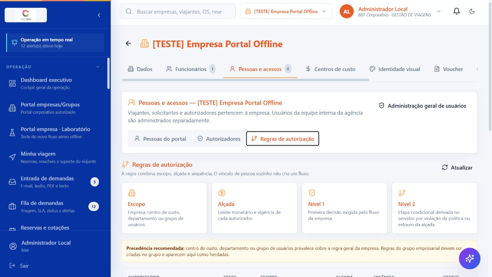
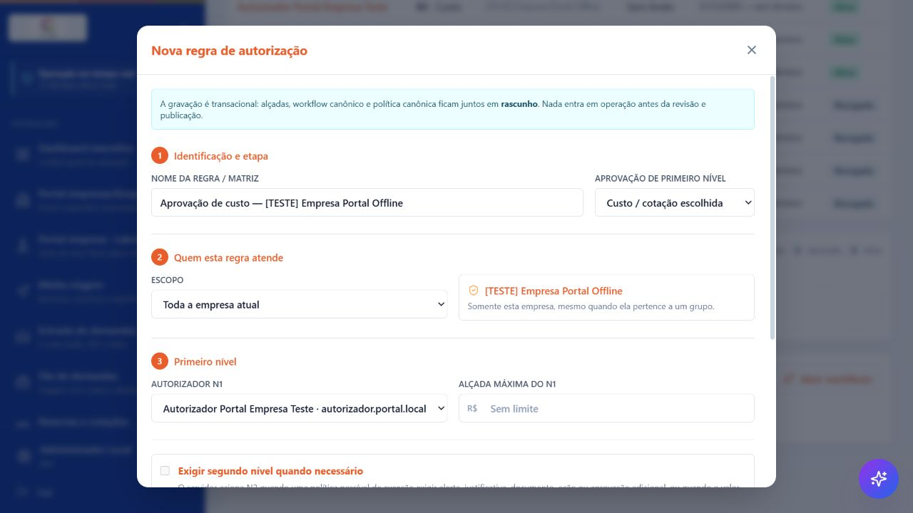
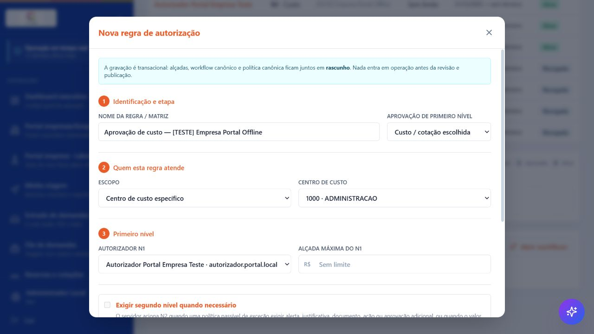
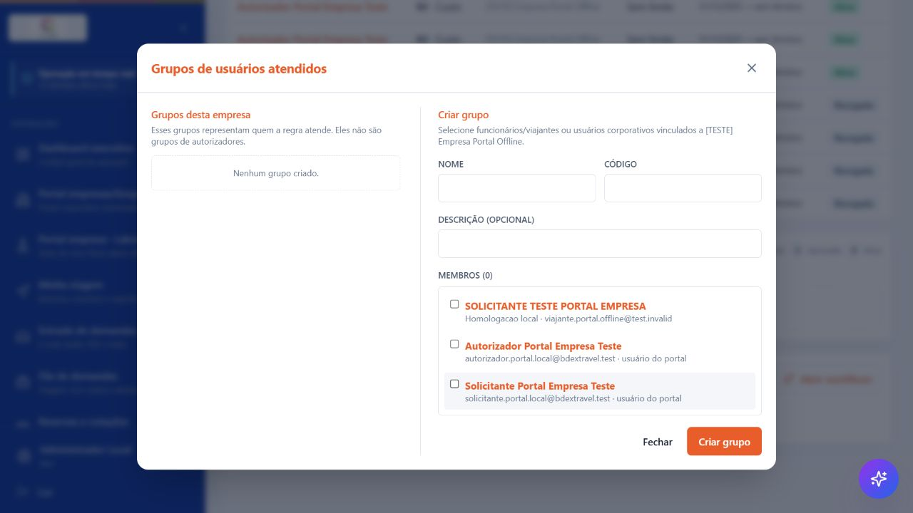
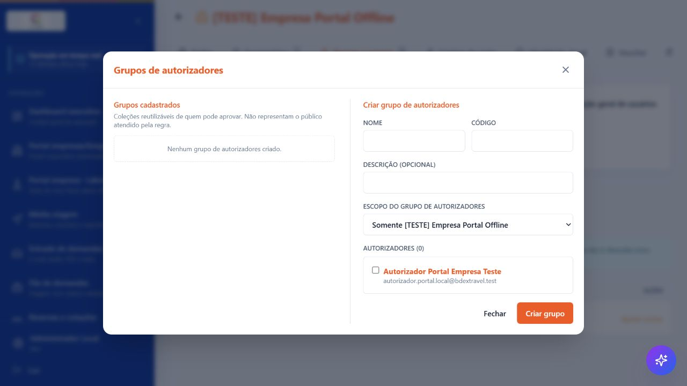
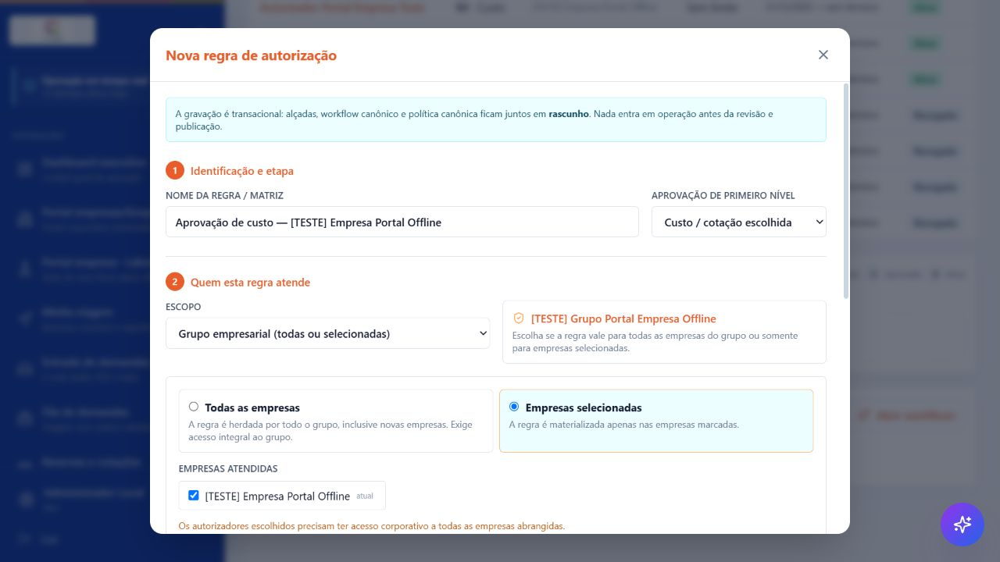
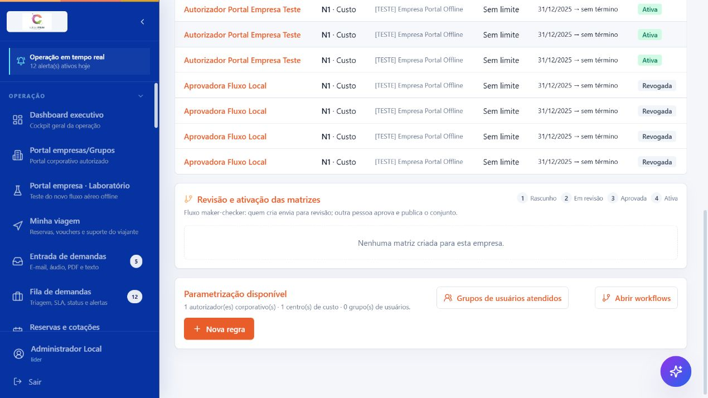

# Tutorial — autorizadores corporativos e atendimento da agência

Este tutorial descreve o fluxo da versão 1.3: o autorizador é escolhido no diretório de funcionários da empresa, enquanto o consultor da agência continua sendo um usuário interno e, quando necessário, atua em nome de uma pessoa da empresa por acesso assistido e auditado.

## Modelo adotado

- Viajantes, solicitantes e autorizadores pertencem à empresa cliente.
- A conta interna da agência não pode ser vinculada como funcionário ou autorizador corporativo.
- O funcionário e seu login são identidades relacionadas, mas não são a mesma coisa. O vínculo é explícito e específico por empresa.
- Atribuir a função de autorizador concede acesso à fila e à decisão. A regra de autorização define em qual recorte, nível e alçada a pessoa pode decidir.
- O consultor pode executar diretamente o trabalho operacional autorizado pelo seu perfil. Escolher cotação e decidir aprovação em nome do cliente exige o acesso assistido, com ator real, pessoa representada, empresa, motivo e referência registrados.

## Pré-requisitos

Antes de atribuir um autorizador, confirme que:

1. o **Portal da empresa** está habilitado no cadastro da empresa;
2. o funcionário está ativo em **Funcionários**;
3. o funcionário tem um e-mail corporativo válido e exclusivo entre os funcionários ativos da mesma empresa;
4. o administrador possui, nessa mesma empresa, `gerenciar_usuarios` e `gerenciar_vinculos_acesso`;
5. para criar e publicar regras, o administrador também possui `gerenciar_workflows`.

Uma conta chamada “Administrador Local” não recebe esses poderes apenas pelo nome do perfil. Se o botão **Atribuir autorizador** ou **Nova regra** não aparecer, confira as permissões efetivas e o escopo da empresa.

## Onde configurar

1. Acesse **Cadastros > Empresas**.
2. Abra a empresa desejada.
3. Entre em **Pessoas e acessos**.
4. Use as subtelas **Pessoas do portal**, **Autorizadores** e **Regras de autorização**.

> **Print v1.3 a recapturar:** cabeçalho **Pessoas e acessos — [empresa]** com as três subtelas. O arquivo `01-pessoas-e-acessos.png` existente foi capturado antes da atualização do diretório e não deve ser usado para demonstrar a atribuição nova.

## 1. Preparar o funcionário

O cadastro-base fica em **Funcionários**. Preencha nome, matrícula, departamento, centro de custo e e-mail conforme a organização da empresa.

O e-mail não é usado para uma associação silenciosa. Ele é validado no servidor e serve para localizar ou criar o login, mas o administrador sempre atribui a função a um `employeeId` específico. Dois funcionários ativos da mesma empresa não podem compartilhar o mesmo e-mail para esse fluxo.

Departamento e centro de custo ajudam na busca e são necessários quando a empresa pretende usar esses recortes nas regras.

## 2. Atribuir o autorizador pelo diretório de funcionários

Abra **Autorizadores** e clique em **Atribuir autorizador**. No modal **Atribuir autorizador corporativo**:

1. use **Buscar funcionário**;
2. procure por nome, matrícula, departamento ou centro de custo;
3. selecione a pessoa;
4. clique em **Atribuir autorizador**.

Não existe mais a opção de digitar livremente uma nova pessoa nem o controle **Também pode solicitar viagens** nessa tela. A função é atribuída ao funcionário já cadastrado. Se ele também for solicitante, esse acesso continua sendo administrado separadamente em **Pessoas do portal**.

> **Print v1.3 a recapturar:** modal **Atribuir autorizador corporativo**, campo **Buscar funcionário**, lista com nome/matrícula/departamento/centro de custo e botão **Atribuir autorizador**. O arquivo `03-atribuir-autorizador.png` mostra a interface anterior e não deve ser reutilizado.

### Confirmação de identidade

Se já existir uma conta corporativa compatível no mesmo workspace, o sistema pode exibir **Identidade a confirmar**. Confira se o nome apresentado pertence ao funcionário selecionado e, somente então, clique em **Confirmar identidade e atribuir**.

Essa confirmação evita vincular automaticamente duas pessoas apenas porque os e-mails coincidem. Contas internas da agência, contas de outro workspace, contas inativas, autoatribuição pelo próprio gestor e e-mails ambíguos são bloqueados.

### Convite e ativação

- Se o funcionário já possui um login corporativo ativo e compatível, a atribuição pode ficar ativa sem novo convite.
- Se ainda não possui login, o sistema cria a identidade convidada e envia um link para definir a senha. O link expira em 72 horas.
- Enquanto o status for **Convite pendente**, **Convite expirado** ou **Envio do convite pendente**, a pessoa ainda não fica disponível para uma regra.
- Use **Reenviar convite** para substituir o convite anterior por um novo. Se aparecer **Envio do convite pendente**, verifique também o serviço de e-mail.
- Após a aceitação e a revalidação do funcionário, da empresa e do e-mail, o status passa para **Ativo** e o uso nas regras passa para **Disponível**.

Os principais rótulos da lista são:

| Rótulo | Significado |
| --- | --- |
| **Ativo** | login e função de autorizador válidos; pode entrar em regras |
| **Login ativo** | a pessoa possui login, mas a função de autorizador não está atribuída |
| **Acesso convidado** | existe uma identidade convidada preservada, sem atribuição ativa |
| **Identidade a confirmar** | existe conta corporativa candidata e a associação exige confirmação explícita |
| **Convite pendente** | atribuição criada, aguardando aceitação |
| **Convite expirado** | é necessário usar **Reenviar convite** |
| **Envio do convite pendente** | a atribuição foi registrada, mas o e-mail não foi entregue |
| **Sem e-mail** / **Bloqueado** | o cadastro precisa ser corrigido antes da atribuição |

> **Print v1.3 a recapturar:** tabela **Autorizadores corporativos** com colunas **Pessoa**, **Organização**, **Status**, **Uso nas regras** e **Ações**. O arquivo `02-autorizadores-corporativos.png` contém a tabela antiga.

## 3. Remover ou cancelar a função

Na coluna **Ações**:

- use **Cancelar atribuição de autorizador** quando o convite ainda não foi aceito;
- use **Remover função de autorizador** quando a pessoa já está ativa.

A remoção preserva o login, o perfil de solicitante e os demais acessos corporativos. Ela remove apenas a capacidade de decidir nessa empresa, revoga as alçadas vigentes e retira a pessoa dos grupos de autorizadores dessa empresa. Se houver aprovações pendentes atribuídas a ela, o sistema exige reatribuição ou delegação antes da remoção.

Uma nova atribuição não restaura silenciosamente as alçadas anteriores; revise ou crie uma nova regra.

## 4. Criar a regra de autorização

Abra **Regras de autorização** e clique em **Nova regra**.

No formulário **Nova regra de autorização**:

1. informe o nome;
2. escolha a etapa:
   - **Custo / cotação escolhida**: autorização financeira da escolha da cotação, com revalidação antes da reserva;
   - **Mérito / necessidade da viagem**: autorização da necessidade da viagem na submissão da demanda;
3. escolha **Quem esta regra atende**;
4. selecione **Autorizador N1** e sua alçada;
5. habilite N2, se necessário;
6. informe vigência e justificativa.

Somente funcionários com status **Ativo** e **Disponível** aparecem como candidatos. O salvamento cria, em uma única transação, a alçada, o workflow e a política canônica em **Rascunho**. Nada entra em operação antes da revisão e publicação.

## 5. Regra por centro de custo

Em **Quem esta regra atende**, selecione **Centro de custo específico** e escolha o centro cadastrado.

Recomendação:

- mantenha uma regra de empresa como fallback;
- crie regras específicas para centros com autorizadores ou limites diferentes;
- a regra de centro de custo prevalece sobre a regra geral;
- se a alçada de N1 do centro for excedida, o fluxo escala para N2 no mesmo recorte, sem trocar silenciosamente pela alçada geral.

## 6. Regra por departamento

Selecione **Departamento específico** e informe o departamento conforme o cadastro dos funcionários e solicitantes.

Exemplos:

- Financeiro → autorizador financeiro;
- Tecnologia → gestor de tecnologia;
- Comercial → diretor comercial.

A comparação normaliza maiúsculas/minúsculas e espaços, mas o cadastro deve permanecer padronizado para facilitar manutenção e auditoria.

## 7. Regra por grupo de usuários

“Grupo de usuários” é o público atendido pela regra — por exemplo, diretoria, VIPs, expatriados ou equipe de campo. Não é um grupo de autorizadores.

1. Em **Regras de autorização**, abra **Grupos de usuários atendidos**.
2. Informe nome, código e descrição.
3. Marque funcionários/viajantes ou usuários corporativos do grupo.
4. Salve o grupo.
5. Em **Nova regra**, selecione **Grupo de usuários**.

Em demandas com vários viajantes, o recorte é acionado quando qualquer viajante corporativo ativo pertence ao grupo, inclusive quem não possui login próprio.

**Grupos de autorizadores** é uma função diferente: mantém coleções reutilizáveis de pessoas que aprovam.

## 8. Regra por empresa ou grupo empresarial

As opções da interface são:

- **Toda a empresa atual**: somente a empresa aberta;
- **Grupo empresarial (todas ou selecionadas) > Empresas selecionadas**: somente as empresas marcadas;
- **Grupo empresarial (todas ou selecionadas) > Todas as empresas**: empresas atuais e futuras do grupo.

Para uma regra multiempresa:

- todas as empresas abrangidas precisam estar ativas e com o portal habilitado;
- o administrador precisa gerenciar workflows em todas as empresas abrangidas;
- cada autorizador precisa ter vínculo corporativo decisório explícito em todas elas;
- **Todas as empresas** exige autoridade sobre todo o grupo e inclui empresas futuras;
- se uma empresa não estiver coberta, a configuração é bloqueada em vez de criar uma matriz parcial.

## 9. Dois níveis de aprovação

Para habilitar N2, mantenha ao menos dois autorizadores corporativos diferentes e disponíveis no recorte.

1. Selecione **Autorizador N1**.
2. Marque **Exigir segundo nível quando necessário**.
3. Informe **Alçada máxima do N1**.
4. Selecione outro **Autorizador N2**.
5. Opcionalmente, informe **Alçada máxima do N2**.

O fluxo começa no N1. O N2 é aberto quando ocorrer pelo menos uma destas situações:

- valor acima da alçada de N1;
- política passível de exceção que exija alerta, justificativa, documento, ação ou aprovação adicional.

Regras de segurança:

- N1 e N2 precisam ser pessoas diferentes;
- o mesmo ator real não pode fornecer as duas decisões por acesso assistido;
- se N1 rejeitar, N2 não é aberto;
- bloqueios rígidos de política continuam bloqueando;
- com apenas um autorizador, N2 fica desabilitado. Se uma viagem exigir duas decisões, o fluxo falha de forma segura até existir um segundo autorizador.

### Exemplo

| Regra | N1 | Alçada N1 | N2 | Resultado |
| --- | --- | ---: | --- | --- |
| Empresa geral | Gestor da empresa | R$ 10.000 | Diretor | Até R$ 10.000: N1; acima: N1 e N2 |
| Centro de custo Diretoria | Assistente executivo | R$ 5.000 | CEO | O recorte da Diretoria prevalece sobre a empresa |
| Grupo VIP | Gestor de viagens | R$ 15.000 | Diretor financeiro | Qualquer viajante do grupo VIP aciona a regra |

## 10. Revisar, aprovar e publicar

Depois de salvar, a matriz segue:

1. **Rascunho** — o criador confere a configuração.
2. **Em revisão** — clique em **Enviar para revisão**.
3. **Aprovada** — outro administrador clica em **Aprovar conjunto**.
4. **Ativa** — o revisor autorizado clica em **Publicar e ativar**.

O criador não pode aprovar ou publicar a própria matriz. Essa separação maker-checker governa a configuração; N1/N2 governa a aprovação das viagens.

## 11. Ordem de precedência

O sistema usa o recorte aplicável mais específico:

1. grupo de usuários atendidos;
2. centro de custo;
3. departamento;
4. empresa;
5. grupo empresarial.

Uma regra específica não é substituída por uma regra geral apenas porque a regra geral possui alçada maior. Quando previsto, o excesso escala para N2 dentro do recorte específico.

## 12. Empresa com um único autorizador

1. Atribua o funcionário em **Autorizadores**.
2. Aguarde o status **Ativo**, se houver convite.
3. Crie uma regra de N1 para empresa, centro de custo, departamento ou grupo de usuários.
4. Deixe **Exigir segundo nível quando necessário** desmarcado.
5. Use **Sem limite** quando não quiser escalonamento por valor.

Esse desenho atende aprovações simples. Se a política ou a alçada exigir duas decisões, cadastre uma segunda pessoa; o mesmo usuário não pode cumprir N1 e N2.

## 13. Dar atendimento completo ao consultor da agência

O consultor não deve ser cadastrado como funcionário ou autorizador da empresa.

1. Acesse **Administração geral de usuários** ou **Usuários**.
2. Crie ou edite uma pessoa em **Equipe interna BBT**.
3. Aplique o preset **Consultor — atendimento completo**.
4. Em **Escopo de acesso**, escolha:
   - **Todas as empresas atuais e futuras**; ou
   - **Somente empresas e grupos selecionados** e marque ao menos um item.
5. Salve.

O preset usa o perfil **Agente** e concede as permissões necessárias para:

- abrir demandas com solicitante e viajante ativos da empresa;
- preparar e ajustar cotações;
- reservar, emitir, cancelar e enviar vouchers;
- consultar a produtividade da equipe.

Essas são ações operacionais diretas. Duas ações pertencem formalmente ao cliente e usam **Suporte assistido**:

- escolher a cotação como o solicitante responsável;
- decidir como o autorizador corporativo que recebeu a atribuição.

> **Print v1.3 a capturar:** edição de usuário interno com o cartão **Consultor — atendimento completo**, áreas **Operação direta**, **Suporte assistido** e **Escopo de acesso**.

## 14. Usar o acesso assistido

O consultor com a permissão **Acessar como usuario corporativo** e MFA recente encontra **Acessar como usuário** no menu do cabeçalho ou na lista de usuários.

No modal **Acessar como usuário**:

1. busque a pessoa corporativa por nome ou e-mail;
2. selecione **Empresa do atendimento** — a representação sempre fica limitada a uma única empresa;
3. escolha **Teste (somente leitura)** ou **Operação assistida**;
4. informe **Motivo**;
5. em operação, informe **Chamado ou referência**;
6. confirme o registro de auditoria;
7. clique em **Iniciar teste** ou **Iniciar operação**.

O acesso dura no máximo 15 minutos. As ações disponíveis são calculadas para a empresa selecionada e exigem a interseção das permissões do consultor real com as da pessoa representada. O banner identifica **Você está acessando como [pessoa]**, o agente responsável e a referência.

Na operação assistida:

- criar/corrigir demanda exige capacidade de demanda para ambos;
- escolher cotação exige operação de cotações para o consultor e capacidade de solicitação para o solicitante representado;
- decidir aprovação exige capacidade decisória para ambos e a aprovação precisa estar atribuída à pessoa representada;
- uma atribuição delegada não pode ser decidida por representação;
- alçada, política e segregação de funções continuam válidas;
- o registro guarda o ator real e o usuário representado.

> **Print v1.3 a capturar:** modal **Acessar como usuário** com **Empresa do atendimento**, **Operação assistida**, **Motivo**, **Chamado ou referência** e duração de 15 minutos; depois, banner do acesso ativo.

## 15. Diagnóstico rápido

| Sintoma | Verificação |
| --- | --- |
| **Atribuir autorizador** não aparece | permissões `gerenciar_usuarios` + `gerenciar_vinculos_acesso` na mesma empresa |
| **Nova regra** não aparece | permissão `gerenciar_workflows` na empresa |
| funcionário não pode ser selecionado | funcionário/empresa ativos, portal habilitado, e-mail válido e exclusivo |
| **Identidade a confirmar** | confira o nome e use **Confirmar identidade e atribuir** somente se for a mesma pessoa |
| convite não chegou | veja **Envio do convite pendente**, valide SMTP e use **Reenviar convite** |
| autorizador não aparece na regra | aguarde **Ativo** e **Disponível**; convite pendente não entra na regra |
| remoção retorna conflito | reatribua ou delegue as aprovações pendentes antes de remover |
| consultor não vê uma empresa | ajuste **Escopo de acesso** do usuário interno |
| **Operação assistida** está indisponível | selecione a empresa e confirme que consultor e pessoa representada possuem as permissões exigidas nela |

## Plano de atualização dos prints

Os prints de regras `04` a `11` permanecem como referência das telas de matriz. Antes de publicar este tutorial fora da equipe, recapture no staging os prints `01`, `02` e `03` após a versão 1.3 e acrescente:

- `12-consultor-atendimento-completo.png`;
- `13-acesso-assistido-empresa.png`;
- `14-banner-acesso-assistido.png`.

Não use montagem ou imagem simulada: capture a interface real, oculte dados pessoais e mantenha visíveis os rótulos citados neste tutorial.

## Limitação conhecida

Uma matriz publicada é protegida contra substituição silenciosa. Enquanto não houver uma tela de retirada/revisão de regra publicada, tentar publicar outra matriz no mesmo recorte retorna erro seguro. Revise limites, vigência, escopo e pessoas antes de publicar.
