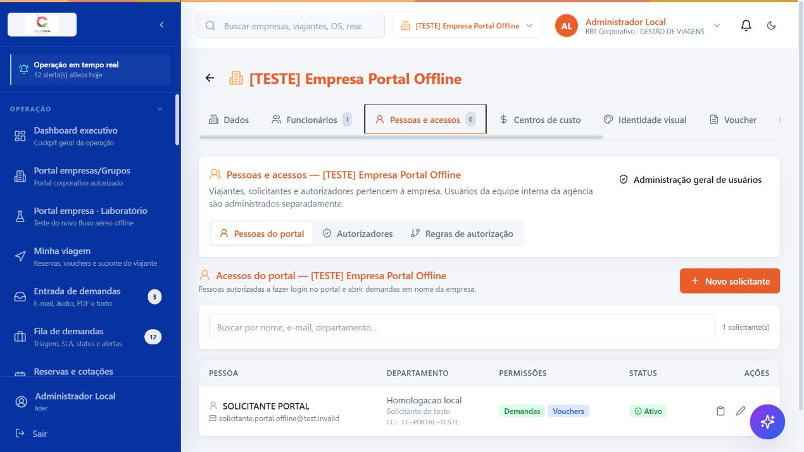
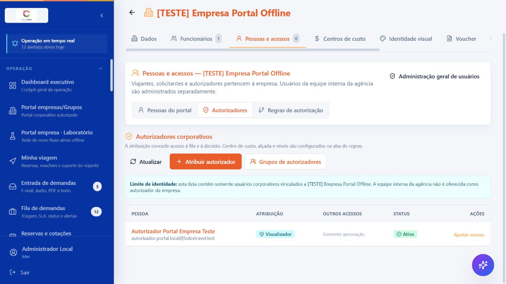
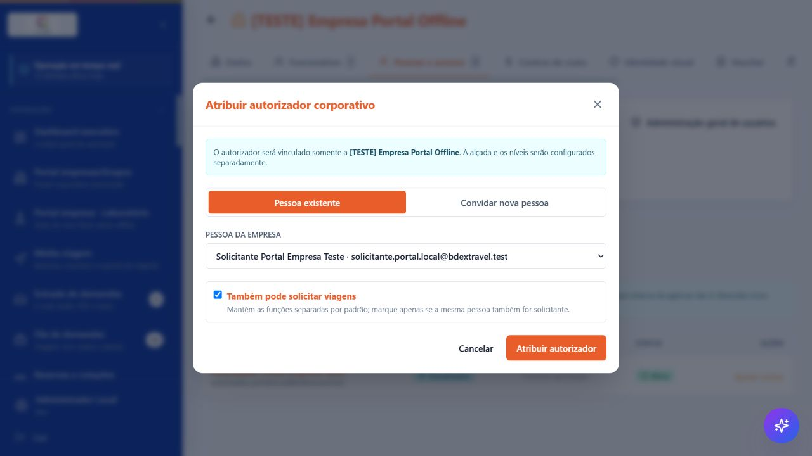

# Tutorial — autorizadores corporativos e regras de autorização

Este tutorial descreve a configuração implantada no BDEX para que o autorizador seja uma pessoa da empresa cliente, e não um usuário da equipe interna da agência.

## Modelo adotado

- Viajantes, solicitantes e autorizadores ficam vinculados à empresa.
- A equipe interna da agência é administrada separadamente. Sem recorte explícito de empresas, seu acesso é global no tenant, mas as ações disponíveis continuam obedecendo ao perfil interno e à auditoria.
- Um usuário interno da agência não aparece como autorizador corporativo.
- Para aprovar em nome do cliente em uma operação assistida, deve-se usar a representação auditada; isso não transforma a agência em aprovadora automática.
- Atribuir uma pessoa como autorizadora concede acesso à fila e à decisão. A regra de autorização define onde, quando e até qual valor ela aprova.

## Onde configurar

1. Acesse **Cadastros > Empresas**.
2. Abra a empresa desejada.
3. Entre em **Pessoas e acessos**.
4. Use as subtelas **Pessoas do portal**, **Autorizadores** e **Regras de autorização**.

## 1. Cadastrar ou atribuir o autorizador da empresa

Abra **Autorizadores**. A lista mostra apenas pessoas corporativas vinculadas à empresa; contas internas da agência não são candidatas.

Clique em **Atribuir autorizador** e escolha uma destas opções:

- **Pessoa existente:** transforma um usuário corporativo já vinculado à empresa em autorizador.
- **Convidar nova pessoa:** cria o acesso corporativo de uma nova pessoa.

Use **Também pode solicitar viagens** somente quando a mesma pessoa realmente acumular as duas funções. Para melhor segregação, deixe desmarcado e mantenha solicitante e autorizador distintos.

Se a pessoa não aparecer, confirme que o acesso está ativo e vinculado à empresa como usuário do **Portal corporativo**. Uma conta da **Equipe interna da agência** não aparecerá nessa lista.

## 2. Criar a regra de autorização

Abra **Regras de autorização** e clique em **Nova regra**.

No formulário:

1. Informe o nome da regra.
2. Escolha a etapa:
   - **Custo / cotação escolhida:** autorização financeira da escolha da cotação, com revalidação antes da reserva.
   - **Mérito / necessidade da viagem:** autorização da necessidade da viagem na submissão da demanda.
3. Escolha o escopo.
4. Selecione o autorizador de N1 e sua alçada.
5. Informe vigência e justificativa.

O salvamento cria, de forma transacional, a alçada, o workflow e a política canônica em **rascunho**. Nada entra em operação antes da revisão e publicação.

## 3. Configuração por centro de custo

Em **Escopo**, selecione **Centro de custo específico** e escolha o centro cadastrado.

Recomendação:

- crie uma regra geral da empresa como fallback;
- crie regras específicas para centros de custo que tenham autorizadores ou limites diferentes;
- a regra específica do centro de custo prevalece sobre a regra geral da empresa;
- se a alçada de N1 do centro for excedida, o sistema exige N2 em vez de cair silenciosamente na alçada geral da empresa.

## 4. Configuração por departamento

Em **Escopo**, selecione **Departamento específico** e informe o departamento exatamente como cadastrado nos funcionários/solicitantes.

Use esse recorte quando cada área possuir seu próprio autorizador, por exemplo:

- Financeiro → autorizador financeiro;
- Tecnologia → gestor de tecnologia;
- Comercial → diretor comercial.

A regra de departamento prevalece sobre a regra geral da empresa. Padronize a escrita dos departamentos para evitar variações como `Financeiro`, `FINANCEIRO` e `Finanças`.

## 5. Configuração por grupo de usuários

Aqui, “grupo de usuários” significa o público atendido pela regra — por exemplo diretoria, VIPs, expatriados ou equipe de campo. Não é um grupo de autorizadores.

1. Em **Regras de autorização**, clique em **Grupos de usuários atendidos**.
2. Informe nome, código e descrição.
3. Marque os funcionários/viajantes ou usuários corporativos que pertencem ao grupo.
4. Crie o grupo.
5. Volte a **Nova regra** e selecione **Grupo de usuários** como escopo.

Em demandas com vários viajantes, a regra é acionada quando qualquer viajante corporativo ativo da demanda pertence ao grupo, inclusive quem não possui login próprio.

Existe também a tela **Grupos de autorizadores**, usada para manter coleções reutilizáveis de pessoas que aprovam. Ela é separada do grupo de usuários atendidos.

## 6. Configuração por empresa ou grupo empresarial

Há três possibilidades:

- **Toda a empresa atual:** vale somente para a empresa aberta.
- **Grupo empresarial > Empresas selecionadas:** vale somente para as empresas marcadas.
- **Grupo empresarial > Todas as empresas:** vale para todas as empresas atuais e futuras do grupo.

Para uma regra multiempresa:

- o administrador precisa poder gerenciar workflows em todas as empresas abrangidas;
- cada autorizador escolhido precisa ter permissão corporativa explícita de decisão em todas elas;
- **Todas as empresas** exige acesso integral ao grupo e também alcança empresas adicionadas futuramente;
- se faltar cobertura em uma empresa, o sistema bloqueia a configuração em vez de publicar uma regra incompleta.

## 7. Dois níveis de aprovação

Para habilitar N2, cadastre pelo menos dois autorizadores corporativos diferentes.

1. Selecione o autorizador de N1.
2. Marque **Exigir segundo nível quando necessário**.
3. Informe a alçada máxima de N1.
4. Selecione outro autorizador em N2.
5. Opcionalmente, informe a alçada máxima de N2.

O fluxo sempre começa no N1. O N2 é aberto quando ocorrer pelo menos uma destas situações:

- valor acima da alçada de N1;
- política passível de exceção que exija aprovação adicional, alerta, justificativa, documento ou ação.

Regras importantes:

- N1 e N2 precisam ser pessoas diferentes;
- o mesmo ator real não pode aprovar os dois níveis por representação;
- se N1 rejeitar, N2 não é aberto;
- bloqueios rígidos de política continuam bloqueando e não podem ser “superados” pelo N2;
- com apenas um autorizador, o N2 fica desabilitado. Uma viagem que realmente exigir duas aprovações falhará de forma segura até existir um segundo autorizador.

### Exemplo recomendado

| Regra | N1 | Alçada N1 | N2 | Resultado |
|---|---|---:|---|---|
| Empresa geral | Gestor da empresa | R$ 10.000 | Diretor | Até R$ 10.000: somente N1; acima: N1 e N2 |
| Centro de custo Diretoria | Assistente executivo | R$ 5.000 | CEO | O recorte da Diretoria prevalece sobre a empresa |
| Grupo VIP | Gestor de viagens | R$ 15.000 | Diretor financeiro | Qualquer viajante do grupo VIP aciona esta regra |

## 8. Revisar, aprovar e publicar

Depois de salvar, a matriz segue o fluxo:

1. **Rascunho** — o criador confere a configuração.
2. **Em revisão** — clique em **Enviar para revisão**.
3. **Aprovada** — outro administrador clica em **Aprovar conjunto**.
4. **Ativa** — o revisor autorizado clica em **Publicar e ativar**.

O criador não pode aprovar ou publicar a própria matriz. Essa separação maker-checker é independente de N1/N2: ela governa quem configura a regra, enquanto N1/N2 governa quem aprova as viagens.

## 9. Ordem de precedência

Entre os recortes solicitados, o sistema resolve do mais específico para o mais geral:

1. grupo de usuários atendidos;
2. centro de custo;
3. departamento;
4. empresa;
5. grupo empresarial.

Assim, uma regra específica não é ignorada em favor de uma alçada geral mais alta. Se o limite da regra específica estourar, o sistema escala para N2.

## 10. Como funciona com um único autorizador

Se a empresa tiver somente um autorizador:

- atribua a pessoa em **Autorizadores**;
- crie uma regra de N1 para a empresa, centro, departamento ou grupo de usuários;
- deixe N2 desabilitado;
- use **Sem limite** quando não desejar escalonamento por valor.

Esse desenho funciona para aprovações simples. Se a política exigir duas decisões ou se for necessário escalonar por alçada, cadastre uma segunda pessoa. O sistema não permite que o mesmo usuário forneça as duas aprovações.

## 11. O que a equipe da agência pode fazer

- Contas internas sem restrição explícita de escopo enxergam todas as empresas atuais e futuras do tenant.
- As ações disponíveis continuam seguindo o perfil interno; abrangência global não significa conceder toda permissão a todo colaborador.
- Líderes/supervisores com as permissões adequadas podem operar demanda, cotação, reserva, emissão e administrar o fluxo.
- A aprovação corporativa continua atribuída a uma pessoa específica da empresa.
- Quando a agência precisar atuar em nome do cliente, deve usar a representação assistida e auditada, respeitando segregação de funções.

Esse desenho permite suporte operacional amplo sem dar à agência poder invisível para autorizar gastos do cliente.

## Observação da versão atual

Uma matriz publicada é protegida contra substituição silenciosa. Nesta versão ainda não há uma tela de revisão/retirada de uma regra já publicada; tentar publicar outra regra no mesmo recorte retorna erro seguro. Portanto, revise limites, vigência, escopo e pessoas antes da publicação.
